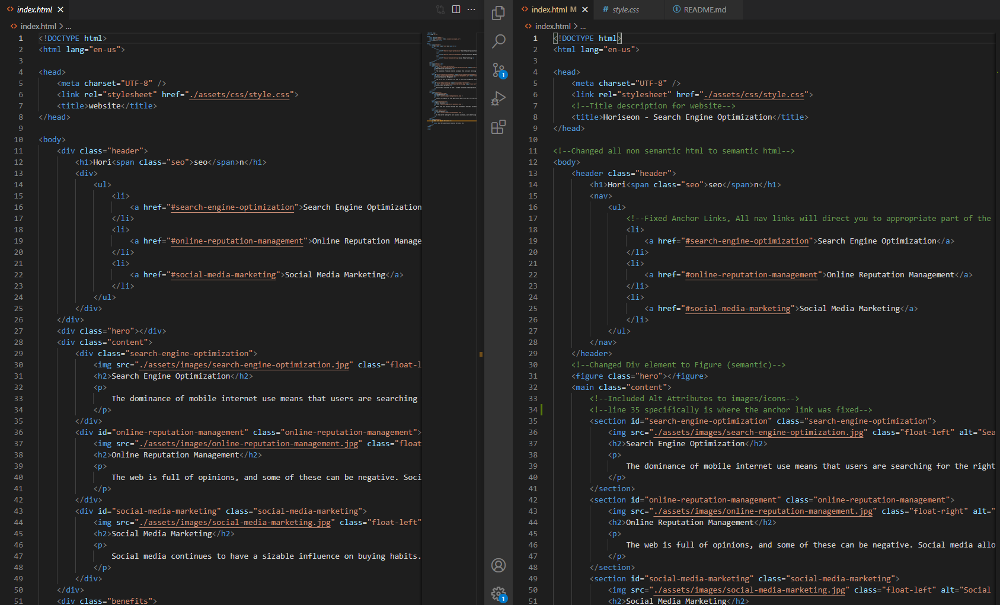

# Refactoring Client Site

## Project Overview

Given the client's (Horiseon) website, I was tasked to refactor their existing code to meet a certain set of standards and to implement a new technology that is more practiced in front end web development. 

The major goal in this project is to implement web accessibility within the website to ensure that people with disablilities can access the website using assistive technologies. 

I have improved the codebase for long term sustainability by seperating non semantic html elements and converting them to their own sementic elements. In doing so, the code is easier to read and change, as well as editing an element individually and not as a group of elements. 

## Installation

Tools Needed:

1. Terminal (MacOS) or
   [GitBash](https://gitforwindows.org/) (Windows)
2. Have a Github account (Not Required)
3. Install text editor of your choice (e.g. VSCode, Atom, etc.)

How to view the project:

1. Navigate in terminal/gitbash where you want to save the project
2. Clone the project via HTTPS or SSH link found in my GitHub repo 
    https://github.com/plotinusspascual/refactoring-client-site
3. After entering the command 'git clone [HTTPS/SSH Link]' in terminal, use command 'code .' to open the project in your default text editor
4. Right click on 'Index.html' and view in live browser to see the website 

## Features

- Source Code includes semantic HTML elements
- Structure of HTML elements follow a logical structure independent of styling and positioning
- Icon and images have accessible alt attributes
- Heading attributes fall in sequential order
- Title element have a concise and decriptive title 

## Images 

Below is a snippet of some before and after html code semantic clean up. 
(Left = Before, Right = After)

Note: Nothing has changed in terms of appearance to the clients website so I will not provide any screenshots of the website.

## Built With

* [HTML](https://developer.mozilla.org/en-US/docs/Web/HTML)
* [CSS](https://developer.mozilla.org/en-US/docs/Web/CSS)

## Deployed Link

* [See Live Site](https://plotinusspascual.github.io/refactoring-client-site/)

## Authors

* **Jose Pascual** 

- [Link to Github](https://github.com/plotinusspascual)
- [Link to LinkedIn](https://www.linkedin.com/in/jose-plotinuss-pascual/)

## License

This project is licensed under the MIT License 

## Contributing

If there are anything I missed or could have done more efficiently please feel free to message me directly through Github

© 2021 Trilogy Education Services, LLC, a 2U, Inc. brand. Confidential and Proprietary. All Rights Reserved.